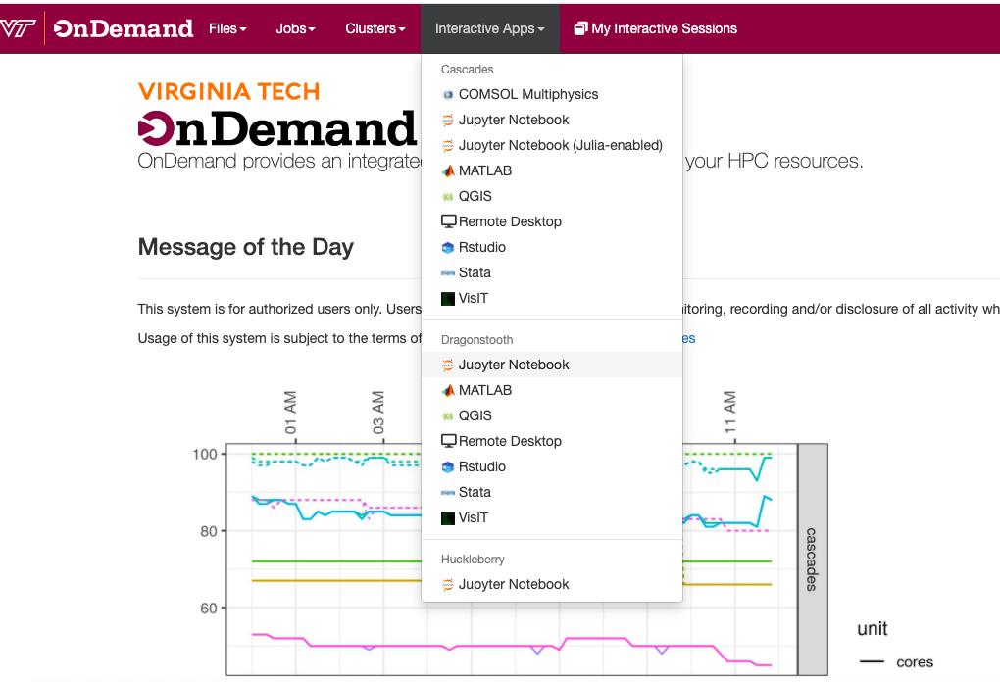

(ood)=
(ondemand)=

# Open OnDemand

Open OnDemand is a web portal that provides access to ARC HPC clusters. It facilitates clusters’ access and job management without the need for Linux experience or any installations on the client-side. The only requirement is an up-to-date web browser. Firefox or Chrome are preferred.

## Features
OnDemand provides the following features

- File Management and Transfer
- Job Management
- Shell Access
- Interactive Apps

## Usage instructions

- In order to use OnDemand, you will need to be using the university network or on VPN (VT Traffic over SSL VPN)
- Once connected, go to either:
  - https://ondemand.arc.vt.edu/ (Legacy site: Older version)
  - https://ood.arc.vt.edu/ (New site: Newer version and features, but still under development in places)
- Then, you can log in using your VT credentials (PID and password). If already logged into another VT site, you may not need to enter any credentials at all.

## Examples

OnDemand provides interactive apps on each of the clusters, as shown in the image below.

See also our [video tutorial](https://video.vt.edu/media/ARCA+Open+OnDemand+for+Browser-based+Cluster+Access/1_nkp1ebuu/176584251 "Open OnDemand").

For complete documentation, please visit Ohio Supercomputer Center, which develops Open OnDemand [detailed documentation pages](https://www.osc.edu/resources/online_portals/ondemand).
